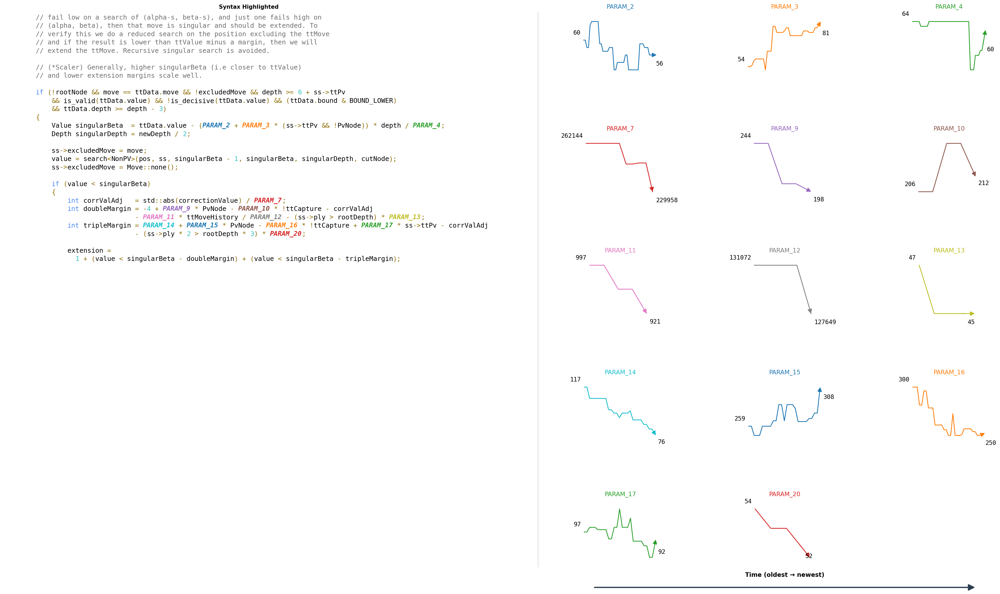

# cpp_param_tracking

Utilities for tracking changes to numeric parameters in C++ snippets using Tree-sitter.
Designed with Stockfish in mind.

## Setup

```bash
conda create -n cpp_param_tracking python=3.12
conda activate cpp_param_tracking
pip install tree-sitter tree-sitter-cpp pytest matplotlib
```

## CLI

Go to the directory of your Stockfish git directory.
Then execute the following command to write output to stdout and to `param_history_plots.png`.

```bash
python track_params.py --file PATH --start-line N --end-line M
```

Omit the file and line arguments to auto-detect the range from current unstaged changes in the repo (a la `git diff`).
Use `--verbose` to surface matcher diagnostics and `--show-all` to include unchanged parameters in the summary.

## Tests

Run the test suite with:

```bash
pytest
```


## Example output plot


